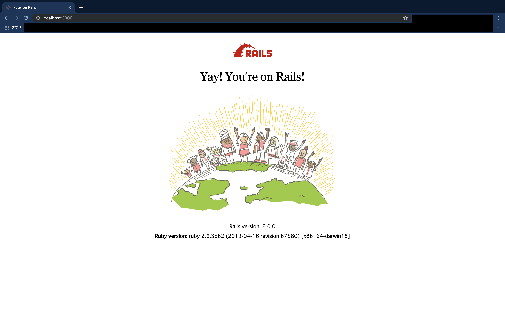

## ゴール

ローカル環境のRails 6.0.0に、Docker環境のデータベースにPostgresqlを設定し接続、Yay! You’re on Rails! する。

## バージョン

rbenv 1.1.2

Bundler 2.0.2

node.js v12.10.0

yarn 1.17.3

postgresql 11.5

Docker 19.03.2

## 前提

ローカル環境で

`$ rbenv -v`

`$ node -v`

`$ yarn -v`

`$ psql --version`

`$ bundle -v`

` $ docker -v` 

` $ docker-compose -v`

が実行できる。

## 環境構築
`$ mkdir [proj-name]`

`$ cd [proj-name]`

`$ bundler init`

生成されたGemFileのrailsのコメントアウトを外す。

`$ bundle exec rails -v` 

- プロジェクト環境のrailsのバージョンを確認する。

`$ bundle --path vendor/bundle -j4` 

- 「--path vendor/bundle」を指定することで、railsアプリのルート下のvendor/bundleにインストールされ、そのアプリケーションの中だけにインストールされる。一度上のコマンドを実行すれば、Bundlerはインストール先を記憶するので次回以降は`bundle install`を実行するだけでよい。
- 「-j4」bundlerを並列処理できる「--jobs=4」

`$ bundle exec rails new . -d postgresql -Tr` 

- 「bundle exec」システム共通ではなくプロジェクト毎のgemを使用する。
- 「rails new .」で現在のディレクトリをアプリケーション名にrails newする。
- 「-d postgresql」データベースにPostgresqlを使用することを指定。
- 「-Tr」「--skip-test」Miniテストを生成しないようにする。

proj-name / docker-compose.ymlに以下を記入
```yaml
version: '3.7'
services:
  postgres:
    image: postgres
    restart: always
    environment:
      POSTGRES_USER: root
      POSTGRES_PASSWORD: root
    hostname: postgres
    ports:
      - 5432:5432
    volumes:
      - ./data/postgres:/var/lib/postgresql/data
```

` $ docker-compose build`

- 先ほど記入したDockerの設定ファイルから仮想環境を構築

` $docker-compose up`

- Docker環境上のPostgresqlを起動

Docker上のデータベースにRailsから接続するための設定をconfig/database.ymlに加える。

```yaml
development:
  <<: *default
  host: localhost
  database: [proj_name]_development
  username: root
  password: root

  ・
  ・
  ・
  ・

test:
  <<: *default
  host: localhost
  database: [proj_name]_test
  username: root
  password: root
```


` $ bin/rails db:create`

- データベースを作成する。

` $ bin/rails server`

- ローカルでRailsを立ち上げる。



参考記事

[bundle, bundle execについて](https://qiita.com/dawn_628/items/1821d4eef22b9f45eea8)

[薄いRailsプロジェクトをRails newする](https://qiita.com/shinkuFencer/items/e6b4e24a92f7b34e9f24)